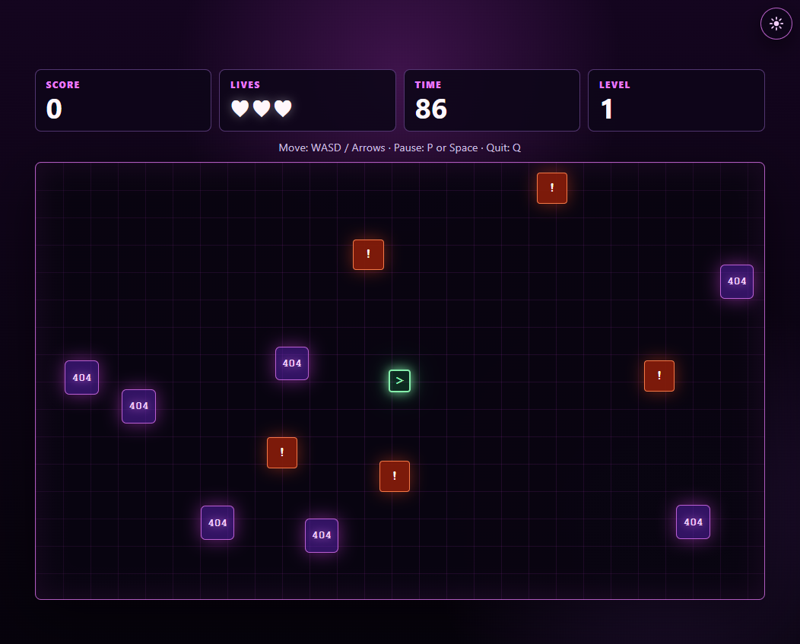

# 404 Arcade Game

404 Arcade Game is a browser-based arcade mini-game where the player collects lost 404 fragments, avoids error blocks, and tries to get the highest score before time runs out.

## Live Demo

Live Demo: https://404-arcade-game.vercel.app

## Screenshot



## Features

- React + TypeScript app built with Vite
- DOM-based game loop powered by `requestAnimationFrame`
- WASD and Arrow Key movement
- Pause and resume support
- Quit round control
- 90-second rounds
- Score, lives, timer, and level tracking
- Level-based difficulty scaling
- Level-based time penalties
- Saved best score, highest level, and games played with `localStorage`
- Light/dark theme toggle

## How to Play

Collect the glowing `404` fragments as they appear around the board. Avoid the moving error blocks, because each hit costs one life and removes time from the round.

Your level increases as your score climbs, which makes the hazards move faster and raises the time penalty for each hit. Stay alive, keep collecting fragments, and try to beat your saved best score before the 90-second timer runs out.

## Controls

| Input | Action |
| --- | --- |
| WASD / Arrow Keys | Move |
| P / Space | Pause or resume |
| Q | Quit round |

## Tech Stack

- React
- TypeScript
- Vite
- CSS

## Local Setup

Install dependencies:

```bash
npm install
```

Start the local dev server:

```bash
npm run dev
```

Create a production build:

```bash
npm run build
```

Run lint checks:

```bash
npm run lint
```

## Project Status

MVP complete. Polish and deployment in progress.

## Future Improvements

- Add sound effects
- Add mobile/touch controls
- Add more enemy patterns
- Add screenshot preview for portfolio
- Deploy live version
